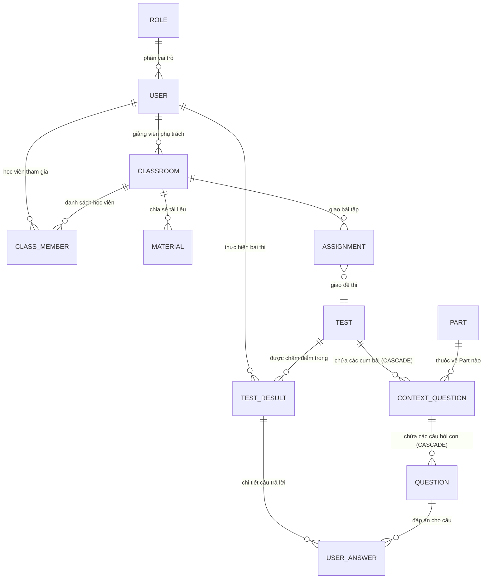

# TOEIC LEARNING & EXAMINATION SYSTEM - PROJECT CONTEXT (SSOT)
> **Mã học phần / Đề tài**: CT446E - Niên luận ngành Công nghệ Thông tin - Trường ĐH Cần Thơ (CTU)  
> **Tác giả / Sinh viên thực hiện**: Trần Anh Vũ (MSSV: B2306603)  
> **Phiên bản tài liệu**: 3.2 (Khắc phục triệt để lỗi LocalDraft đè mất dữ liệu DB: Luôn ưu tiên CSDL Server làm SSOT khi Edit đề thi, bổ sung nút Tải lại CSDL và bảo toàn câu hỏi khi chuẩn hóa số lượng cụm)  
> **Vị trí file**: `PROJECT_CONTEXT.md` (Thư mục gốc của repository)  
> **Mục đích tài liệu**: Tài liệu này đóng vai trò là **nguồn ngữ cảnh duy nhất (Single Source of Truth - SSOT)** cho toàn bộ dự án. Toàn bộ mã nguồn, cấu trúc CSDL, nghiệp vụ thi ETS, API Endpoints, kiến trúc Frontend/Backend và các thay đổi đều được nén lại chi tiết tại đây. Lập trình viên và AI Assistant chỉ cần đọc duy nhất file này để nắm trọn vẹn 100% dự án mà không cần quét lại toàn bộ thư mục mã nguồn.

---

## MỤC LỤC
1. [TỔNG QUAN HỆ THỐNG & PHÂN QUYỀN (SYSTEM OVERVIEW & RBAC)](#1-tổng-quan-hệ-thống--phân-quyền-system-overview--rbac)
2. [CẤU TRÚC THƯ MỤC TOÀN DỰ ÁN (PROJECT DIRECTORY TREE)](#2-cấu-trúc-thư-mục-toàn-dự-án-project-directory-tree)
3. [CƠ SỞ DỮ LIỆU & QUAN HỆ THỰC THỂ (DATABASE SCHEMA & SEED DATA)](#3-cơ-sở-dữ-liệu--quan-hệ-thực-thể-database-schema--seed-data)
4. [QUY CHUẨN ĐỀ THI ETS TOEIC & LOGIC THỨ TỰ (CORE BUSINESS LOGIC)](#4-quy-chuẩn-đề-thi-ets-toeic--logic-thứ-tự-core-business-logic)
5. [CHI TIẾT KIẾN TRÚC BACKEND (SPRING BOOT 3, APIS & SERVICES)](#5-chi-tiết-kiến-trúc-backend-spring-boot-3-apis--services)
6. [CHI TIẾT KIẾN TRÚC FRONTEND (REACT 18/19, VITE, PAGES & STUDIO)](#6-chi-tiết-kiến-trúc-frontend-react-1819-vite-pages--studio)
7. [HỆ THỐNG LỚP HỌC & BÀI TẬP (CLASSROOM & ASSIGNMENT SYSTEM)](#7-hệ-thống-lớp-học--bài-tập-classroom--assignment-system)
8. [NHẬT KÝ THAY ĐỔI & CÁC ĐIỂM SỬA ĐỔI QUAN TRỌNG (CHANGELOG)](#8-nhật-ký-thay-đổi--các-điểm-sửa-đổi-quan-trọng-changelog)
9. [HƯỚNG DẪN KHỞI CHẠY & NGUYÊN TẮC PHÁT TRIỂN (DEVELOPER HANDBOOK)](#9-hướng-dẫn-khởi-chạy--nguyên-tắc-phát-triển-developer-handbook)

---

## 1. TỔNG QUAN HỆ THỐNG & PHÂN QUYỀN (SYSTEM OVERVIEW & RBAC)

Hệ thống **TOEIC Learning** là nền tảng e-learning & thi thử trực tuyến mô phỏng 100% cấu trúc bài thi TOEIC Listening & Reading theo chuẩn ETS 2026. Nền tảng kết hợp giữa luyện thi cá nhân và quản lý lớp học trực tuyến.

### Phân quyền người dùng (Role-Based Access Control - RBAC):
1. **`ROLE_ADMIN` (Quản trị viên)**:
   - Quản lý người dùng toàn hệ thống: Xem danh sách, tìm kiếm, lọc theo vai trò, khóa/mở khóa tài khoản (`is_locked`).
   - Quản trị đề thi toàn quyền: Tạo đề mới, cập nhật, xuất bản (`PUBLISHED`), chuyển về nháp (`DRAFT`), xóa vĩnh viễn đề thi kèm dọn sạch media trên Cloudinary.
   - Quản lý tất cả lớp học trong hệ thống.
2. **`ROLE_TEACHER` (Giáo viên)**:
   - Soạn thảo đề thi, tạo bản nháp đề thi, quản lý bài tập kiểm tra.
   - Tạo lớp học (`Classroom`), cấp mã lớp (`class_code`), duyệt học sinh (`ClassMember`).
   - Chia sẻ tài liệu học tập (`Material`), giao bài tập (`Assignment`) kèm hạn nộp và liên kết đề thi.
3. **`ROLE_USER` (Học viên)**:
   - Thư viện đề thi: Xem và tìm kiếm các bộ đề thi đã được công bố (`status = PUBLISHED`).
   - Chế độ thi Full Test 200 câu: Có đồng hồ đếm ngược 120 phút, tự động nộp bài, tính điểm Listening (5-495), Reading (5-495), Tổng điểm (10-990).
   - Chế độ Luyện tập theo Part (Practice Mode): Luyện riêng từng Part (Part 1 -> Part 7) không áp lực thời gian.
   - Xem lại bài thi (Review Mode): Hiển thị chi tiết đáp án của thí sinh, đáp án đúng, lời giải thích (`explanation`) và lời thoại audio (`transcript`).
   - Theo dõi tiến độ học tập: Chuỗi ngày học (`current_streak`, `highest_streak`), lịch sử điểm số bài thi (`test_result`).
   - Tham gia lớp học bằng mã lớp (`class_code`), làm bài tập giáo viên giao.

---

## 2. CẤU TRÚC THƯ MỤC TOÀN DỰ ÁN (PROJECT DIRECTORY TREE)

```text
TOEIC_LEARNING/
│
├── PROJECT_CONTEXT.md             <-- [SSOT] Ngữ cảnh nén toàn diện của toàn bộ dự án
├── README.md                      <-- Giới thiệu tổng quan repository
│
├── backend/                       <-- BACKEND SPRING BOOT 3 (JAVA 17)
│   ├── pom.xml                    <-- Maven dependencies (Spring Web, Data JPA, Security, MySQL, JJWT, Cloudinary)
│   ├── database_script.sql        <-- Script DDL khởi tạo 14 bảng và DML dữ liệu mẫu hoàn chỉnh
│   └── src/main/
│       ├── resources/
│       │   └── application.properties <-- Port 8080, CSDL MySQL, JWT Secret (HS512), Cloudinary Config
│       └── java/com/ctu_cit_nienLuanNganh/toeicLearning/
│           ├── ToeicLearningApplication.java <-- Main Application Entrypoint
│           ├── common/            <-- Kiến trúc dùng chung toàn backend
│           │   ├── dto/           <-- ApiResponse<T>, PageResponse<T>, PageParams, BaseDTO, BaseCreatedUpdatedDTO
│           │   ├── enums/         <-- ErrorCode (mã lỗi chuẩn), TestStatus (DRAFT, PUBLISHED)
│           │   ├── exception/     <-- AppException, GlobalExceptionHandler (@RestControllerAdvice)
│           │   └── service/       <-- CloudinaryService (uploadFile, deleteFileByUrl)
│           ├── config/            <-- Cấu hình hệ thống
│           │   ├── SecurityConfig.java   <-- Spring Security, CORS localhost:5173, BCrypt, Filter chain
│           │   └── CloudinaryConfig.java <-- Bean Cloudinary cấu hình từ application.properties
│           ├── entity/            <-- 14 JPA Entities ánh xạ CSDL MySQL
│           │   ├── base/          <-- BaseEntity, BaseCreatedUpdatedEntity (UUID, createdAt, updatedAt)
│           │   ├── Role.java, User.java, Test.java, Part.java
│           │   ├── ContextQuestion.java, Question.java, TestResult.java, UserAnswer.java
│           │   ├── Classroom.java, ClassMember.java, Material.java, Assignment.java
│           │   └── PaymentTransaction.java, Notification.java
│           ├── module/            <-- Tổ chức theo Module chức năng
│           │   ├── auth/          <-- Đăng ký, đăng nhập, cấp phát JWT (AuthController, AuthService)
│           │   ├── exam/          <-- Quản lý đề thi, làm bài thi, luyện tập part
│           │   │   ├── ExamController.java
│           │   │   ├── dto/       <-- PartForUserResponseDTO, TestDetailResponseDTO, v.v.
│           │   │   ├── mapper/    <-- PartForUserMapper, TestMapper
│           │   │   ├── request/   <-- CreateTestRequest, ContextQuestionRequest, QuestionRequest
│           │   │   └── service/   <-- ExamService (Lưu đề, tính orderIndex, dọn media thừa, publish/draft)
│           │   ├── classroom/     <-- Quản lý lớp học (ClassRoomController, ClassroomResponseDTO)
│           │   ├── media/         <-- Upload file đa phương tiện (MediaController)
│           │   ├── user/          <-- Quản lý thông tin học viên cá nhân (UserController, UserService)
│           │   └── admin/         <-- Quản trị danh sách người dùng (AdminController, AdminService)
│           ├── repository/        <-- Spring Data JPA Repositories
│           │   ├── TestRepository.java, PartRepository.java
│           │   ├── ContextQuestionRepository.java (findByTestIdAndPartIdOrderByOrderIndexAsc)
│           │   ├── QuestionRepository.java, UserRepository.java, RoleRepository.java
│           │   ├── TestResultRepository.java, UserAnswerRepository.java
│           │   └── base/BaseRepository.java
│           └── security/          <-- Xử lý JWT Token
│               ├── JwtService.java (Tạo token, giải mã token, kiểm tra hạn)
│               ├── JwtAuthenticationFilter.java (Bắt header Authorization Bearer)
│               └── JwtAuthenticationEntryPoint.java (Xử lý lỗi 401 Unauthorized)
│
└── frontend/                      <-- FRONTEND REACT 18/19 + VITE + TAILWINDCSS
    ├── package.json               <-- Dependencies: react-router-dom, axios, lucide-react, tailwindcss
    ├── vite.config.js             <-- Vite build tool (dev server port 5173)
    ├── index.html                 <-- HTML single-page container
    └── src/
        ├── index.css              <-- Design system, bảng màu TOEIC, custom scrollbar, animations
        ├── App.jsx                <-- Hệ thống định tuyến (React Router v6) & bọc AuthProvider
        ├── api/
        │   └── apiClient.js       <-- Axios Instance (BaseURL: /api, Request Interceptor tự đính kèm JWT)
        ├── context/
        │   └── AuthContext.jsx    <-- Context xác thực: user, token, login(), logout(), hasRole()
        ├── services/
        │   ├── examService.js     <-- Gọi API đề thi (/api/exam/...)
        │   ├── uploadService.js   <-- Gọi API upload Cloudinary (/api/media/upload)
        │   ├── authService.js     <-- Gọi API login/register (/api/auth/...)
        │   ├── userService.js     <-- Gọi API profile (/api/user/...)
        │   └── adminService.js    <-- Gọi API quản trị người dùng (/api/admin/...)
        ├── constants/
        │   └── etsDirections.js   <-- Hướng dẫn làm bài chuẩn ETS của 7 Part
        ├── components/
        │   ├── layout/
        │   │   ├── Navbar.jsx     <-- Thanh điều hướng, menu người dùng, hiển thị streak
        │   │   ├── Footer.jsx     <-- Footer chân trang
        │   │   └── ProtectedRoute.jsx <-- Bảo vệ tuyến đường theo Token và Role
        │   └── common/
        │       └── ErrorBoundary.jsx <-- Bắt lỗi hiển thị giao diện an toàn
        └── pages/
            ├── HomePage.jsx       <-- Trang chủ giới thiệu nền tảng
            ├── AboutPage.jsx, ContactPage.jsx <-- Trang tĩnh thông tin & liên hệ
            ├── CoursesPage.jsx    <-- Danh sách thư viện đề thi TOEIC
            ├── CourseDetailPage.jsx <-- Chi tiết cấu trúc đề thi, lựa chọn chế độ thi
            ├── ExamTakePage.jsx   <-- PHÒNG THI ONLINE (120p, audio player, bảng câu hỏi, cờ vàng, chấm điểm)
            ├── PracticePage.jsx   <-- Luyện tập chuyên sâu theo từng Part (Part 1 - Part 7)
            ├── LoginPage.jsx, RegisterPage.jsx <-- Đăng nhập & Đăng ký
            ├── ProfilePage.jsx    <-- Hồ sơ cá nhân, thống kê streak, lịch sử thi
            └── admin/
                ├── UserManagementPage.jsx <-- Quản lý người dùng (khóa/mở tài khoản, phân role)
                └── TestManagementPage.jsx <-- STUDIO QUẢN TRỊ ĐỀ THI (Tạo 200 câu, Clean Form, upload media)
```

---

## 3. CƠ SỞ DỮ LIỆU & QUAN HỆ THỰC THỂ (DATABASE SCHEMA & SEED DATA)

Database Engine: **MySQL 8.0+**, Charset: `utf8mb4`, Collation: `utf8mb4_unicode_ci`.  
Mọi khóa chính (`id`) sử dụng chuẩn `VARCHAR(36)` (UUID v4).

### 3.1. Sơ đồ thực thể ERD:


### 3.2. Đặc tả chi tiết 14 bảng dữ liệu:

1. **`role`**: Vai trò người dùng.
   - `id` VARCHAR(36) PK
   - `role_name` VARCHAR(50) NOT NULL UNIQUE (`ROLE_ADMIN`, `ROLE_USER`, `ROLE_TEACHER`)
2. **`user`**: Tài khoản người dùng.
   - `id` VARCHAR(36) PK
   - `user_name` VARCHAR(100) NOT NULL
   - `user_email` VARCHAR(100) NOT NULL UNIQUE
   - `user_numberphone` VARCHAR(15)
   - `user_password` VARCHAR(255) NOT NULL (mã hóa BCrypt)
   - `user_avatar` VARCHAR(255) (link ảnh avatar)
   - `is_locked` BOOLEAN DEFAULT FALSE (trạng thái khóa tài khoản)
   - `current_streak` INT DEFAULT 0 (chuỗi ngày học liên tục hiện tại)
   - `highest_streak` INT DEFAULT 0 (chuỗi ngày học kỷ lục)
   - `total_score` INT DEFAULT 0 (tổng điểm tích lũy)
   - `role_id` VARCHAR(36) FK -> `role(id)`
   - `created_at`, `updated_at` TIMESTAMP
3. **`part`**: Danh mục 7 Part chuẩn TOEIC.
   - `id` VARCHAR(36) PK
   - `part_number` INT NOT NULL UNIQUE (1 -> 7)
   - `part_name` VARCHAR(100) NOT NULL (Photographs, Question - Response, Short Conversations, Short Talks, Incomplete Sentences, Text Completion, Reading Comprehension)
   - `description` TEXT
4. **`test`**: Bộ đề thi TOEIC.
   - `id` VARCHAR(36) PK
   - `title_test` VARCHAR(255) NOT NULL (Tên đề thi)
   - `status` ENUM('DRAFT', 'PUBLISHED') DEFAULT 'DRAFT'
   - `created_at`, `updated_at` TIMESTAMP
5. **`context_question`**: Cụm câu hỏi / Đoạn audio / Bài đọc.
   - `id` VARCHAR(36) PK
   - `audio_url` VARCHAR(500) (File MP3 trên Cloudinary)
   - `image_url` VARCHAR(500) (File ảnh trên Cloudinary)
   - `paragraph` LONGTEXT (Đoạn văn đọc hiểu của Part 6, Part 7; đối với các Part nghe Part 1, 2, 3, 4 trường này để `NULL` hoặc chuỗi rỗng)
   - `transcript` LONGTEXT (Lời thoại bài nghe audio tiếng Anh)
   - `translation` LONGTEXT (**MỚI: Bản dịch tiếng Việt của đoạn hội thoại Part 3 và bài nói Part 4**, lưu riêng biệt)
   - `order_index` INT DEFAULT 0 (**QUAN TRỌNG**: Lưu số thứ tự câu hỏi bắt đầu của cụm, VD: 1..6, 7..31, 32, 35, 38, ..., 71, 74, ..., 101..130, 131, 135..., 147...)
   - `test_id` VARCHAR(36) NOT NULL FK -> `test(id)` ON DELETE CASCADE
   - `part_id` VARCHAR(36) NOT NULL FK -> `part(id)`
   - Index: `idx_context_question_order_follow_test_id (test_id, order_index)`
6. **`question`**: Câu hỏi con trắc nghiệm.
   - `id` VARCHAR(36) PK
   - `question_content` TEXT (Nội dung câu hỏi)
   - `option_a` TEXT NOT NULL
   - `option_b` TEXT NOT NULL
   - `option_c` TEXT NOT NULL
   - `option_d` TEXT (Với Part 2, trường này để trống `NULL` hoặc `""`)
   - `correct_answer` CHAR(1) NOT NULL ('A', 'B', 'C', 'D')
   - `explanation` LONGTEXT (Giải thích chi tiết lời giải)
   - `question_number` INT DEFAULT 0 (**QUAN TRỌNG**: Số thứ tự câu hỏi chuẩn trong đề từ 1 đến 200)
   - `context_question_id` VARCHAR(36) NOT NULL FK -> `context_question(id)` ON DELETE CASCADE
   - Index: `idx_question_order_follow_context_question_id (context_question_id, question_number)`
7. **`test_result`**: Kết quả làm bài thi của học viên.
   - `id` VARCHAR(36) PK
   - `listening_score` INT DEFAULT 0 (Điểm Listening 5 -> 495)
   - `reading_score` INT DEFAULT 0 (Điểm Reading 5 -> 495)
   - `total_score` INT DEFAULT 0 (Tổng điểm 10 -> 990)
   - `correct_count` INT DEFAULT 0 (Số câu đúng)
   - `total_count` INT DEFAULT 0 (Tổng số câu trong bài nộp)
   - `total_time` INT DEFAULT 0 (Thời gian làm bài tính bằng giây)
   - `user_id` VARCHAR(36) NOT NULL FK -> `user(id)`
   - `test_id` VARCHAR(36) NOT NULL FK -> `test(id)`
   - `part_id` VARCHAR(36) NULL FK -> `part(id)` (Nếu làm riêng theo Part)
   - `assignment_id` VARCHAR(36) NULL FK -> `assignment(id)` (Nếu làm theo bài tập giáo viên giao)
   - `created_at`, `updated_at` TIMESTAMP
8. **`user_answer`**: Lựa chọn đáp án của học viên cho từng câu hỏi.
   - `id` VARCHAR(36) PK
   - `selected_option` CHAR(1) ('A', 'B', 'C', 'D')
   - `is_correct` BOOLEAN DEFAULT FALSE
   - `question_id` VARCHAR(36) NOT NULL FK -> `question(id)`
   - `test_result_id` VARCHAR(36) NOT NULL FK -> `test_result(id)` ON DELETE CASCADE
9. **`classroom`**: Lớp học do giáo viên phụ trách.
   - `id` VARCHAR(36) PK
   - `class_name` VARCHAR(150) NOT NULL
   - `class_code` VARCHAR(20) NOT NULL UNIQUE (Mã tham gia lớp)
   - `description` TEXT
   - `teacher_id` VARCHAR(36) NOT NULL FK -> `user(id)`
   - `created_at`, `updated_at` TIMESTAMP
10. **`class_member`**: Thành viên trong lớp.
    - `id` VARCHAR(36) PK
    - `class_id` VARCHAR(36) NOT NULL FK -> `classroom(id)` ON DELETE CASCADE
    - `student_id` VARCHAR(36) NOT NULL FK -> `user(id)`
    - `status` ENUM('PENDING', 'APPROVED') DEFAULT 'APPROVED'
    - `created_at`, `updated_at` TIMESTAMP
11. **`material`**: Tài liệu học tập trong lớp.
    - `id` VARCHAR(36) PK
    - `title` VARCHAR(255) NOT NULL
    - `file_url` VARCHAR(500) NOT NULL
    - `class_id` VARCHAR(36) NOT NULL FK -> `classroom(id)` ON DELETE CASCADE
    - `created_at`, `updated_at` TIMESTAMP
12. **`assignment`**: Bài tập giao cho lớp.
    - `id` VARCHAR(36) PK
    - `title` VARCHAR(255) NOT NULL
    - `due_date` DATETIME NOT NULL
    - `test_id` VARCHAR(36) NOT NULL FK -> `test(id)`
    - `class_id` VARCHAR(36) NOT NULL FK -> `classroom(id)` ON DELETE CASCADE
    - `created_at`, `updated_at` TIMESTAMP
13. **`payment_transaction`**: Giao dịch nâng cấp gói học viên.
    - `id` VARCHAR(36) PK
    - `amount` DECIMAL(10, 2) NOT NULL
    - `status` ENUM('PENDING', 'SUCCESS', 'FAILED') DEFAULT 'PENDING'
    - `user_id` VARCHAR(36) NOT NULL FK -> `user(id)`
    - `created_at`, `updated_at` TIMESTAMP
14. **`notification`**: Thông báo người dùng.
    - `id` VARCHAR(36) PK
    - `title` VARCHAR(255) NOT NULL
    - `content` TEXT NOT NULL
    - `is_read` BOOLEAN DEFAULT FALSE
    - `user_id` VARCHAR(36) NOT NULL FK -> `user(id)`
    - `created_at`, `updated_at` TIMESTAMP

### 3.3. Dữ liệu Seed cố định (Fixed Seed Data):
- **Role UUIDs**:
  - `0d0bcedb-aeaa-11f1-b6c1-c0e43471a03a`: `ROLE_ADMIN`
  - `0d0bf593-aeaa-11f1-b6c1-c0e43471a03a`: `ROLE_USER`
  - `0d0bf686-aeaa-11f1-b6c1-c0e43471a03a`: `ROLE_TEACHER`
- **Part UUIDs**:
  - `0d104916-aeaa-11f1-b6c1-c0e43471a03a`: `Part 1` (Photographs)
  - `0d10545b-aeaa-11f1-b6c1-c0e43471a03a`: `Part 2` (Question - Response)
  - `0d10551f-aeaa-11f1-b6c1-c0e43471a03a`: `Part 3` (Short Conversations)
  - `0d105559-aeaa-11f1-b6c1-c0e43471a03a`: `Part 4` (Short Talks)
  - `0d10565f-aeaa-11f1-b6c1-c0e43471a03a`: `Part 5` (Incomplete Sentences)
  - `0d1056cd-aeaa-11f1-b6c1-c0e43471a03a`: `Part 6` (Text Completion)
  - `0d105702-aeaa-11f1-b6c1-c0e43471a03a`: `Part 7` (Reading Comprehension)
- **Tài khoản mặc định**:
  - Quản trị viên: `vub2306603@student.ctu.edu.vn` (Pass: hash BCrypt trong script)
  - Học viên mẫu: `trananhvu314159@gmail.com`
- **Đề thi mẫu ETS 2026 - Test 01**:
  - ID: `ddaaa16f-8d39-4669-9e60-6c9de8270c00` (`PUBLISHED`).
  - **Part 1 (Q1 -> Q6)**: 6 cụm câu hỏi, `order_index = 1..6`, `question_number = 1..6`, có file MP3 & ảnh Cloudinary thật 100%.
  - **Part 2 (Q7 -> Q31)**: 25 cụm câu hỏi, `order_index = 7..31`, `question_number = 7..31`, 25 file MP3 Cloudinary riêng cho từng câu, đáp án chỉ gồm A, B, C (Option D rỗng).
  - **Part 3 (Q32 -> Q43)**: 4 cụm câu hỏi (`order_index = 32, 35, 38, 41`), 12 câu hỏi (`question_number = 32..43`). Trường `audio_url` và `image_url` để `NULL` sẵn sàng cho việc tải file qua giao diện Studio, trường `transcript` và `translation` tách riêng độc lập.

---

## 4. QUY CHUẨN ĐỀ THI ETS TOEIC & LOGIC THỨ TỰ (CORE BUSINESS LOGIC)

### 4.1. Bảng quy chuẩn 7 Part đề thi TOEIC:

| Part | Phân ban | Dạng bài ETS | Tổng câu | Cấu trúc Cụm (Context) | Giá trị `order_index` (ContextQuestion) | Giá trị `question_number` (Question) | Quy cách Đáp án |
| :--- | :--- | :--- | :--- | :--- | :--- | :--- | :--- |
| **Part 1** | Listening | Photographs | 6 câu | 1 câu/cụm (6 cụm) | `1, 2, 3, 4, 5, 6` | `1, 2, 3, 4, 5, 6` | Cố định (A), (B), (C), (D) |
| **Part 2** | Listening | Question - Response | 25 câu | 1 câu/cụm (25 cụm) | `7, 8, 9, ..., 31` | `7, 8, 9, ..., 31` | **Chỉ có (A), (B), (C)** (D luôn để trống) |
| **Part 3** | Listening | Short Conversations | 39 câu | 3 câu/cụm (13 cụm) | `32, 35, 38, 41, 44, 47, 50, 53, 56, 59, 62, 65, 68` | `32 -> 70` (Mỗi cụm 3 câu tăng liên tiếp) | A, B, C, D |
| **Part 4** | Listening | Short Talks | 30 câu | 3 câu/cụm (10 cụm) | `71, 74, 77, 80, 83, 86, 89, 92, 95, 98` | `71 -> 100` (Mỗi cụm 3 câu tăng liên tiếp) | A, B, C, D |
| **Part 5** | Reading | Incomplete Sentences | 30 câu | 1 câu/cụm (30 cụm) | `101, 102, ..., 130` | `101 -> 130` | A, B, C, D |
| **Part 6** | Reading | Text Completion | 16 câu | 4 câu/cụm (4 bài đọc) | `131, 135, 139, 143` | `131 -> 146` (Mỗi bài đọc 4 câu con) | A, B, C, D |
| **Part 7** | Reading | Reading Comprehension | 54 câu | 2 - 5 câu/cụm (Đoạn đơn/đoạn kép) | Số câu bắt đầu đoạn (VD: `147, 149, 153...`) | `147 -> 200` | A, B, C, D |

### 4.2. Nguyên tắc Lưu trữ và Sắp xếp Thứ tự:
1. **`context_question.order_index`**:
   - **Luôn lưu số thứ tự của câu hỏi đầu tiên trong cụm đó**.
   - Ví dụ: Đoạn hội thoại gồm 3 câu 32, 33, 34 thì `order_index` = 32. Cụm tiếp theo gồm câu 35, 36, 37 thì `order_index` = 35.
2. **`question.question_number`**:
   - **Luôn lưu số thứ tự liên tiếp từ 1 đến 200** của từng câu hỏi trong đề thi.
3. **Cơ chế tự động sắp xếp trong Hibernate JPA**:
   - `Test.java`: `@OrderBy("orderIndex ASC") private List<ContextQuestion> contextQuestions;`  
     $\rightarrow$ Khi gọi API lấy Full Test (`getTestDetail`), Hibernate tự động sắp xếp các ContextQuestion theo thứ tự tăng dần của `orderIndex`.
   - `ContextQuestion.java`: `@OrderBy("questionNumber ASC") private List<Question> questions;`  
     $\rightarrow$ Trong từng ContextQuestion, danh sách các câu hỏi con luôn tự động sắp xếp tăng dần theo `questionNumber`.
4. **Cơ chế truy vấn luyện tập theo Part**:
   - `ContextQuestionRepository.java`:
     ```java
     List<ContextQuestion> findByTestIdAndPartIdOrderByOrderIndexAsc(String testId, String partId);
     ```
     $\rightarrow$ Đảm bảo khi học viên luyện riêng một Part, các cụm bài vẫn được load ra chuẩn xác từ câu đầu đến câu cuối theo `order_index`.
5. **Loại bỏ thẻ kỹ thuật Sequence Tag (`<!--CQ_SEQ:P{part}:I{startQ}-->`)**:
   - *Lịch sử trước đây*: Khi chưa có cột `order_index` chuẩn hóa, frontend từng chèn tiền tố `<!--CQ_SEQ:P{part}:I{startQ}-->` vào cột `paragraph` để đánh dấu Part và số câu bắt đầu.
   - *Chuẩn hóa hiện tại (v2.9)*: Trường `order_index` trong `context_question` và `part_id` đã đảm nhận hoàn toàn việc định vị và sắp xếp thứ tự chính xác 100%. Do đó, việc chèn thẻ `<!--CQ_SEQ:...-->` vào `paragraph` là hoàn toàn thừa thãi và đã **BỊ LOẠI BỎ TRIỆT ĐỂ**:
     - Khi lưu đề thi (`handleSaveExam`), frontend lưu đoạn văn sạch thuần túy (`paragraph: cleanParagraph`), không còn sinh bất kỳ thẻ HTML nào. Các Part 1, 2, 3, 4 lưu giá trị rỗng/NULL.
     - Khi nạp dữ liệu cũ (`handleOpenEditModal` & `ExamTakePage`), frontend vẫn giữ regex lọc bỏ an toàn để tương thích ngược với các đề thi cũ từng lưu trong CSDL.
     - Dữ liệu mẫu khởi tạo trong `backend/database_script.sql` đã được làm sạch toàn bộ về `NULL`.
6. **Quy chuẩn lưu trữ Bản dịch tiếng Việt qua cột `translation` riêng biệt**:
   - **Tách bạch 100% trong DB**: Bảng `context_question` sở hữu 2 cột riêng biệt:
     - `transcript`: Lưu toàn bộ lời thoại âm thanh tiếng Anh (Audio Transcript).
     - `translation`: Lưu bản dịch tiếng Việt tương ứng cho đoạn hội thoại (Part 3) và bài nói (Part 4).
   - **Luồng xử lý REST API Frontend <-> Backend**:
     - *Client gửi lên*: `ContextQuestionRequest` chứa 2 trường riêng biệt `transcript` và `translation`.
     - *Backend xử lý*: `ExamService.saveTestDetail` ánh xạ `.transcript(...)` và `.translation(...)` lưu trực tiếp vào CSDL MySQL.
     - *Client đọc về*: Nhận trực tiếp `cq.transcript` và `cq.translation`.
     - *Cơ chế tương thích ngược (Fallback)*: Nếu dữ liệu mẫu cũ còn chứa separator `--- BẢN DỊCH TIẾNG VIỆT ---` trong `transcript`, Frontend tự động bóc tách thông minh sang `translation` để đảm bảo giao diện luôn hiển thị chính xác.

---

## 5. CHI TIẾT KIẾN TRÚC BACKEND (SPRING BOOT 3, APIS & SERVICES)

### 5.1. Danh mục API Endpoints:

#### 1. Module Xác thực (`/api/auth`):
- `POST /api/auth/register`: Đăng ký tài khoản học viên mới.
- `POST /api/auth/login`: Đăng nhập (trả về JWT Token, email, user_name, role_name).
- `POST /api/auth/logout`: Hủy phiên đăng nhập.

#### 2. Module Đề thi (`/api/exam`):
- `GET /api/exam/list`: Lấy danh sách đề thi phân trang.
  - Query params: `numberPage` (default 1), `sizeOfPage` (default 10), `keyWord`, `sortBy`, `direction`, `status`.
  - Phân quyền: Học viên thông thường chỉ thấy `status = PUBLISHED`. Admin/Teacher thấy cả `DRAFT` và `PUBLISHED`.
- `GET /api/exam/{testID}`: Lấy chi tiết Full Test (200 câu) kèm cấu trúc Part, ContextQuestion và Question.
- `GET /api/exam/{testID}/parts/{partID}`: Lấy danh sách câu hỏi của 1 Part cụ thể (trả về `PartForUserResponseDTO`) phục vụ màn hình Luyện tập theo Part.
- `POST /api/exam/create`: Tạo bộ đề thi mới (`PreAuthorize("hasAnyRole('ADMIN', 'TEACHER')")`).
- `PUT /api/exam/update/{testID}`: Cập nhật nội dung đề thi, tự động dọn dẹp media thừa trên Cloudinary (`PreAuthorize("hasAnyRole('ADMIN', 'TEACHER')")`).
- `PATCH /api/exam/{testID}/publish`: Xuất bản đề thi sang `PUBLISHED` để học viên thi thử.
- `PATCH /api/exam/{testID}/draft`: Thu hồi đề thi về bản nháp `DRAFT`.
- `DELETE /api/exam/delete/{testID}`: Xóa vĩnh viễn đề thi, tự động dọn toàn bộ audio và ảnh trên Cloudinary (`PreAuthorize("hasRole('ADMIN')")`).

#### 3. Module Media (`/api/media`):
- `POST /api/media/upload`: Tải file audio (`audio/mpeg`, `audio/mp3`, `audio/wav`) hoặc hình ảnh (`image/png`, `image/jpeg`, `image/webp`) lên Cloudinary (`multipart/form-data`).
  - Thư mục lưu trên Cloudinary:
    - Audio: `Resource/toeic-learning/exams/{examSlug}/audios`
    - Ảnh: `Resource/toeic-learning/exams/{examSlug}/images`

#### 4. Module Lớp học (`/api/classroom`):
- Quản lý tạo lớp, cấp `class_code`, duyệt thành viên lớp, chia sẻ tài liệu và giao bài tập.

#### 5. Module Cá nhân & Quản trị (`/api/user`, `/api/admin`):
- `GET /api/user/profile`: Lấy thông tin cá nhân của user đang đăng nhập.
- `PUT /api/user/profile`: Cập nhật họ tên, số điện thoại, avatar.
- `GET /api/admin/users`: Danh sách người dùng hệ thống (tìm kiếm, lọc role, phân trang).
- `PATCH /api/admin/users/{userId}/lock`: Khóa hoặc mở khóa tài khoản.

### 5.2. Các Service Cốt lõi:

1. **`ExamService.java`**:
   - `saveTestDetail`: Duyệt qua cây đề thi, tính toán `orderIndex` và `questionNumber`.
     - Sử dụng helper `getStartingQuestionNumber(partIndex, questionCounter)`:
       - Part 1 $\rightarrow$ 1 | Part 2 $\rightarrow$ 7 | Part 3 $\rightarrow$ 32 | Part 4 $\rightarrow$ 71 | Part 5 $\rightarrow$ 101 | Part 6 $\rightarrow$ 131 | Part 7 $\rightarrow$ 147.
     - Nếu request gửi `orderIndex == null` hoặc `<= 0`, tự động gán `orderIndex` bằng số thứ tự của câu đầu tiên trong cụm đó.
     - Đánh số liên tục cho `questionNumber` của từng câu hỏi con.
   - `deleteUnuseMedia`: Tự động so sánh danh sách URL media cũ trong database với URL media mới trong payload cập nhật. Mọi file không còn dùng sẽ được gửi lệnh xóa trực tiếp lên Cloudinary.
   - `getPart`: Gọi `contextQuestionRepository.findByTestIdAndPartIdOrderByOrderIndexAsc(testId, partId)` và map sang `PartForUserResponseDTO`.
2. **`CloudinaryService.java`**:
   - `uploadFile`: Nhận `MultipartFile` và `folderName`, tải lên Cloudinary và trả về secure URL.
   - `deleteFileByUrl`: Trích xuất `public_id` từ URL và gọi API Cloudinary để xóa file ngay lập tức.
3. **`JwtService.java`**:
   - Ký token bằng thuật toán `HS512` với secret key bảo mật cấu hình trong `application.properties`.
   - Lưu trữ `userId`, `email`, `role` trong payload Claims của JWT.

---

## 6. CHI TIẾT KIẾN TRÚC FRONTEND (REACT 18/19, VITE, PAGES & STUDIO)

### 6.1. Danh mục Tuyến đường & Phân trang (`App.jsx`):
- `/`: `HomePage` (Giới thiệu, tính năng nổi bật).
- `/about`: `AboutPage` (Giới thiệu dự án và giảng viên hướng dẫn).
- `/contact`: `ContactPage` (Liên hệ & góp ý).
- `/courses`: `CoursesPage` (Thư viện đề thi có bộ lọc tìm kiếm).
- `/courses/:testId`: `CourseDetailPage` (Xem cấu trúc đề, số câu Listening/Reading, chọn chế độ thi).
- `/courses/:testId/take`: `ExamTakePage` (**Phòng thi trực tuyến chuẩn ETS**).
- `/practice`: `PracticePage` (Luyện thi chuyên sâu theo Part 1 -> 7).
- `/login`: `LoginPage`, `/register`: `RegisterPage`.
- `/profile`: `ProfilePage` (Hồ sơ, chuỗi học streak, lịch sử thi và điểm số).
- `/admin/tests`: `TestManagementPage` (**Studio Quản trị & Soạn thảo Đề thi**).
- `/admin/users`: `UserManagementPage` (Quản trị tài khoản người dùng).

### 6.2. Quy chuẩn Thiết kế Studio Quản trị Đề thi (`TestManagementPage.jsx`):

1. **Nguyên tắc "Form Nhập Sạch" (Clean Form Standard)**:
   - Khi tạo mới đề thi, thêm Part, thêm cụm câu hỏi hay thêm câu hỏi con, **tất cả các trường nhập liệu đều được khởi tạo là chuỗi rỗng (`""`)**.
   - Tuyệt đối **không điền trước dữ liệu mẫu (mock data, mock paragraph, link demo) vào thuộc tính `value`** của input / textarea, giúp người dùng không phải xóa đi xóa lại.
   - Toàn bộ hướng dẫn mẫu chỉ được thể hiện qua thuộc tính HTML `placeholder` (chữ mờ tự động biến mất khi bắt đầu gõ).
   - **Ngoại lệ chuẩn ETS cho Part 1 & Part 2**:
     - Part 1: Câu hỏi mặc định `"Select the statement that best describes what you see in the picture."` và 4 lựa chọn `(A)`, `(B)`, `(C)`, `(D)`.
     - Part 2: Câu hỏi mặc định `"Mark your answer on your answer sheet."` và 3 lựa chọn `(A)`, `(B)`, `(C)`.
     *(Lý do: Đề thi thật ETS không in câu hỏi chữ cho Part 1 & 2 mà chỉ in mã phương án)*.
2. **Hệ thống Nút Khởi tạo Nhanh 1-Click (Fast Setup Buttons)**:
   - `Khởi tạo khung Full Test 200 câu ETS`: Tạo sẵn bộ khung 7 Part chuẩn với đúng tỷ lệ câu hỏi, sẵn sàng để người dùng nhập liệu hoặc upload media.
   - `Khởi tạo Mini Test 50 câu`: Tạo khung 50 câu rút gọn theo đúng tỷ lệ ETS.
   - `Chuẩn hóa 6 câu Part 1`, `Chuẩn hóa 25 câu Part 2`, `Chuẩn hóa 13 đoạn Part 3`, `Chuẩn hóa 10 bài Part 4`: Định dạng lại Part hiện tại về đúng cấu trúc chuẩn.
3. **Tiện ích Media Studio**:
   - Hỗ trợ upload trực tiếp file MP3 hoặc dán link URL Cloudinary.
   - Hỗ trợ upload ảnh đề bài, preview trực tiếp và modal phóng to ảnh gốc (`ZoomIn`).
4. **Bảo toàn Thứ tự Tự động**:
   - Hàm `handleSaveExam` tính toán tự động `orderIndex` (số câu bắt đầu) và `questionNumber` (1 -> 200) trước khi gửi payload lên backend.
5. **Khu vực Nhập Bản dịch Đoạn hội thoại & Bài nói (Part 3 & Part 4)**:
   - Cung cấp ô nhập liệu riêng biệt cho **Bản dịch tiếng Việt (Vietnamese Translation)** song song với **Lời thoại tiếng Anh (Audio Transcript)**.
   - Có nút bấm chèn sẵn mẫu đối thoại tiếng Anh và mẫu bản dịch tiếng Việt chuẩn cho Part 3 (đối thoại Man/Woman) và Part 4 (thông báo độc thoại sân bay/hội nghị).
   - Card Header hiển thị badge trạng thái trực quan: `✓ Đã có bản dịch` / `Chưa có bản dịch`.
   - **Cơ chế lưu trữ tương thích 100%**: Lưu trực tiếp vào cột `translation` của bảng `context_question`, đồng thời hỗ trợ đọc song ngữ mượt mà.
6. **Kiến Trúc Auto-Save Đa Tầng (Hybrid Multi-Tier Auto-Save) & Phân Tích Hiệu Năng**:
   - **Bài toán hiệu năng (Vấn đề lưu database mỗi 5 giây)**:
     - Đề thi TOEIC chuẩn là một payload đồ sộ (200 câu hỏi, 70+ context questions, 800 options, transcript, audio, translation, dung lượng JSON từ 150KB - 500KB).
     - Việc gửi HTTP request và ghi đè toàn bộ cây 270+ records vào MySQL mỗi 5 giây là **Anti-pattern cực kỳ nguy hiểm**: gây bão hòa I/O đĩa cứng, cạn kiệt Connection Pool (`HikariCP`), nghẽn CPU Spring Boot và có nguy cơ chạm rate-limit Cloudinary khi chạy `deleteUnuseMedia`. Nếu có 5 giáo viên cùng soạn bài, server sẽ lập tức bị quá tải.
   - **Giải pháp Kiến trúc Hybrid Đa Tầng chuẩn công nghiệp**:
     - **Tầng 1 (Client-Side Storage - Tức thời mỗi 5 giây)**: Lưu ngầm liên tục vào `localStorage` (`toeic_exam_studio_autosave`) mỗi 5s (debounce 1.5s). **Tải lên Server: 0%** (0 request, 0 database write, 0 băng thông). Chống 100% rủi ro mất điện, tắt máy, F5, rớt mạng.
     - **Tầng 2 (Smart Server Sync - Chu kỳ an toàn 30 giây kèm Dirty Check)**: Định kỳ mỗi 30s, hệ thống kiểm tra cờ `isDirty`. Nếu người dùng thực sự có chỉnh sửa mới và không có request khác đang chạy (`!actionLoading`), hệ thống kích hoạt lưu ngầm âm thầm (`isSilent = true`) lên máy chủ. Nếu không có thay đổi, **tuyệt đối không gửi request**.
     - **Tầng 3 (On-Demand User Save - Chủ động tức thì)**: Phím tắt `Ctrl + S` hoặc nút `Lưu nháp máy chủ` trên Sticky Bar cho phép giáo viên lưu cưỡng bức lên database bất kỳ lúc nào sau khi hoàn thành 1 cụm câu hỏi.
   - **Khôi phục bản nháp thông minh (Draft Recovery)**: Tự động phát hiện dữ liệu chưa lưu trong `localStorage` và hiển thị banner khôi phục khi mở Studio.
7. **Nới lỏng Ràng buộc Soạn thảo (Relaxed Draft Validation) & Phím tắt Lưu nhanh (Ctrl+S)**:
   - **Không bao giờ chặn lưu Bản nháp (`DRAFT`)**: Người dùng có thể lưu tạm đề thi bất kỳ lúc nào dù Part 3 & 4 mới chỉ làm 1, 2 đoạn hay 3 câu trong tổng số 39 câu. Các câu hỏi chưa nhập nội dung hoặc đáp án sẽ tự động gán fallback chuỗi rỗng `""` và đáp án `'A'`, hoàn toàn tương thích và an toàn với ràng buộc `NOT NULL` của CSDL MySQL.
   - **Lưu nháp máy chủ 1-Click & Phím tắt `Ctrl + S`**: Bấm nút `Lưu nháp máy chủ (Ctrl+S)` hoặc nhấn tổ hợp phím `Ctrl + S` / `Cmd + S` để lưu ngay lập tức lên backend mà **không làm đóng modal**, không mất vị trí cuộn chuột, cho phép tiếp tục soạn thảo liền mạch.
   - **Cảnh báo thông minh khi Xuất bản (`PUBLISHED`)**: Nếu người dùng nhấn Xuất bản mà còn câu hỏi trống, hệ thống không văng lỗi chặn đứng mà đưa ra hộp thoại hỏi thăm: *"Phát hiện còn X câu hỏi chưa điền đủ. Bạn có muốn lưu dưới dạng BẢN NHÁP (DRAFT) để bổ sung sau không?"*. Chỉ cần 1 cú click [OK] là tự động chuyển sang DRAFT và lưu ngay vào database.
8. **Thanh Công Cụ Nổi Cố Định (Sticky Quick Action Bar)**:
   - Thanh công cụ dính trên cùng (`sticky -top-4 z-30`) chứa tên đề thi, trạng thái auto-save đa tầng (`Tự lưu trình duyệt` / `Đã đồng bộ máy chủ`), nút `Lưu nháp máy chủ (Ctrl+S)` và nút `Xuất bản đề thi`.

### 6.3. Trải nghiệm Phòng thi Trực tuyến (`ExamTakePage.jsx`):
- **Đồng hồ đếm ngược**: 120 phút cho Full Test (cảnh báo khi còn dưới 5 phút, tự động nộp bài khi hết giờ).
- **Lưới điều hướng câu hỏi (Question Navigation Grid)**:
  - Trạng thái 1: Chưa làm (màu xám).
  - Trạng thái 2: Đã chọn đáp án (màu xanh thương hiệu TOEIC).
  - Trạng thái 3: Đánh dấu xem lại (Cờ vàng - Flagged).
  - Bấm vào số câu hỏi: Cuộn mượt (smooth scroll) ngay đến vị trí câu hỏi tương ứng trên màn hình.
- **Trình phát âm thanh**: Hỗ trợ nghe audio từng câu/đoạn hoặc phát audio chung.
- **Chấm điểm tự động**:
  - Chấm điểm Listening (5 - 495) và Reading (5 - 495) theo bảng quy đổi TOEIC chuẩn.
  - Hiển thị tổng điểm (10 - 990), tỷ lệ phần trăm và phân tích theo từng Part.
- **Chế độ Xem lại Lời giải (Review Mode)**:
  - Hiển thị đáp án thí sinh đã chọn so với đáp án đúng.
  - Hiển thị tách biệt 2 khối card thẩm mỹ:
    - **Lời thoại âm thanh tiếng Anh (Audio Transcript)** trong khung nền Slate/Indigo.
    - **Bản dịch tiếng Việt (Vietnamese Translation)** trong khung nền Emerald viền nét đứt kèm icon `Languages` sinh động.
  - Hiển thị lời giải thích chi tiết (`explanation`) của từng câu hỏi con.

---

## 7. HỆ THỐNG LỚP HỌC & BÀI TẬP (CLASSROOM & ASSIGNMENT SYSTEM)

Hệ thống hỗ trợ tương tác giữa Giáo viên (`ROLE_TEACHER`) và Học viên (`ROLE_USER`):
1. **Quản lý lớp học (`Classroom`)**:
   - Giáo viên tạo lớp học mới, hệ thống tự động sinh `class_code` duy nhất.
   - Học viên nhập `class_code` để gửi yêu cầu tham gia lớp.
   - Giáo viên duyệt học sinh (`ClassMember.status = APPROVED`).
2. **Chia sẻ tài liệu (`Material`)**:
   - Giáo viên tải file bài giảng, giáo trình PDF lên hệ thống để học viên tải về.
3. **Giao bài tập kiểm tra (`Assignment`)**:
   - Giáo viên chọn một bộ đề thi (`test_id`) trong hệ thống và đặt hạn nộp (`due_date`).
   - Học viên vào làm bài kiểm tra trong thời gian quy định.
   - Điểm số làm bài được lưu vào `test_result` có gắn `assignment_id` để giáo viên chấm và thống kê xếp hạng lớp.

---

## 8. NHẬT KÝ THAY ĐỔI & CÁC ĐIỂM SỬA ĐỔI QUAN TRỌNG (CHANGELOG)

### Đợt 1: Nâng cấp Logic Thứ tự Câu hỏi & Cụm Câu hỏi:
- **Vấn đề trước đây**: `context_question.order_index` trước đây đánh số 0, 1, 2... đơn giản, dẫn đến việc không xác định được đoạn đó tương ứng với câu hỏi số mấy trong đề thi chuẩn.
- **Giải pháp đã thực hiện**:
  1. CSDL (`backend/database_script.sql`): Cập nhật giá trị `order_index` của `context_question` lưu **số thứ tự câu hỏi bắt đầu của cụm đó** (Part 1: 1..6, Part 2: 7..31, Part 3: 32, 35, 38..., Part 4: 71, 74..., Part 5: 101..130, Part 6: 131, 135, 139, 143, Part 7: 147, 149...).
  2. Entity JPA:
     - `Test.java`: Thêm `@OrderBy("orderIndex ASC")` cho `contextQuestions`.
     - `ContextQuestion.java`: Thêm `@OrderBy("questionNumber ASC")` cho `questions`.
  3. Repository: Thêm `findByTestIdAndPartIdOrderByOrderIndexAsc(testId, partId)` vào `ContextQuestionRepository.java`.
  4. Backend Service: Cập nhật `ExamService.java` hỗ trợ hàm `getStartingQuestionNumber` và tự động tính `orderIndex`, `questionNumber`.
  5. Frontend: Cập nhật `handleSaveExam` trong `TestManagementPage.jsx` và ưu tiên `orderIndex` trong `ExamTakePage.jsx`.

### Đợt 2: Chuẩn hóa Form Nhập liệu Studio Quản trị Đề thi (Clean Form Standard):
- **Vấn đề trước đây**: Khi tạo mới hoặc thêm câu hỏi/đoạn văn, giao diện điền sẵn quá nhiều chữ mẫu mock text (như "Đoạn văn đọc hiểu mẫu...", "Giải thích chi tiết..."), buộc người dùng phải bôi đen và xóa thủ công nhiều lần.
- **Giải pháp đã thực hiện**:
  1. `TestManagementPage.jsx`: Cập nhật `createFreshQuestion` và `createFreshContextQuestion` khởi tạo giá trị chuỗi rỗng `""` cho tất cả các trường (`questionContent`, `optionA-D`, `explanation`, `paragraph`, `transcript`, `audioUrl`, `imageUrl`).
  2. Chuyển toàn bộ nội dung hướng dẫn thành HTML `placeholder` mờ.
  3. Giữ nguyên câu hỏi chuẩn ETS và nhãn phương án (A, B, C, D) cho Part 1 & 2 để người dùng không phải gõ tay lại câu lệnh nghe.
  4. Xác minh build: `npm run build` thành công 100%, 0 lỗi cú pháp.

### Đợt 4: Chuẩn hóa Toàn diện Cột `translation` Độc lập (Database, Backend & Frontend):
- **Cơ sở dữ liệu (`database_script.sql`)**: Bổ sung cột `translation TEXT` vào bảng `context_question`.
- **Backend Java**:
  - `ContextQuestion.java`: Thêm `@Column(name = "translation", columnDefinition = "TEXT") private String translation;`.
  - `ContextQuestionRequest.java`: Thêm thuộc tính `private String translation;`.
  - `ExamService.java`: Ánh xạ `.translation(contextQuestionRequest.getTranslation())` vào entity khi tạo mới/cập nhật đề thi.
- **Frontend React**:
  - `TestManagementPage.jsx`: Nhập liệu ô tiếng Anh và ô tiếng Việt độc lập, gửi thẳng `translation: cq.translation` lên API backend.
  - `ExamTakePage.jsx`: Đọc trường `currentContext.translation` để hiển thị card Bản dịch tiếng Việt song ngữ riêng biệt, giữ fallback bóc tách tự động cho dữ liệu cũ.
- **Xác minh**: Biên dịch `npm run build` thành công 100%, 0 lỗi cú pháp.

### Đợt 5: Nâng cấp Auto-Save Liên tục, Quick Draft Server Save (Ctrl+S) & Nới lỏng Ràng buộc Part 3/4 Drafts:
- **Vấn đề giải quyết**: Trước đây khi tạo đề Part 3 (13 đoạn x 3 câu = 39 câu) và Part 4 (10 bài x 3 câu = 30 câu), hệ thống bắt buộc phải điền đủ toàn bộ 100% nội dung câu hỏi và 4 đáp án mới cho lưu. Đồng thời không có tính năng tự động lưu liên tục, khiến người dùng phải copy paste khối lượng lớn dữ liệu rất mỏi tay, mỏi mắt, và có nguy cơ mất sạch công sức nếu vô tình đóng tab hoặc mất kết nối.
- **Giải pháp đã triển khai**:
  1. **Nới lỏng hoàn toàn ràng buộc khi Lưu Bản nháp (`DRAFT`)**: Cho phép lưu dở dang với bất kỳ số lượng câu hỏi nào. Tự động gắn giá trị chuỗi rỗng an toàn (`""`) cho câu hỏi và đáp án chưa điền, đảm bảo tương thích 100% với ràng buộc `NOT NULL` của CSDL MySQL.
  2. **Kiến trúc Hybrid Auto-Save 2 tầng tối ưu hiệu năng**:
     - **Tầng 1 (Client Storage mỗi 5s)**: Tự động lưu tức thì vào `localStorage` mỗi 5s (debounce 1.5s), 0% tải server.
     - **Tầng 2 (Smart Server Sync 30s)**: Tự động đồng bộ ngầm lên database máy chủ chu kỳ an toàn 30s kèm Dirty Checking (`isDirtyRef`), chỉ gửi request khi có thay đổi thực tế.
  3. **Khôi phục bản nháp chưa lưu (Draft Recovery Banner)**: Tự động phát hiện và cung cấp nút bấm 1-click khôi phục phiên làm việc trước đó nếu trình duyệt bị tắt đột ngột.
  4. **Thanh công cụ ghim cố định (Sticky Quick Action Bar)**: Ghim trên đầu modal (`sticky -top-4 z-30`) chứa huy hiệu trạng thái auto-save đa tầng, nút `Lưu nháp máy chủ (Ctrl+S)` và `Xuất bản đề thi`, dễ dàng thao tác dù đang ở câu 70 hay 100.
  5. **Phím tắt `Ctrl + S`**: Hỗ trợ lưu nháp tức thì lên database máy chủ trong nền mà không tắt modal.
  6. **Cảnh báo thông minh khi Xuất bản (`PUBLISHED`)**: Nếu còn câu hỏi trống, tự động hỏi người dùng có muốn chuyển sang lưu `BẢN NHÁP (DRAFT)` không và lưu ngay lập tức nếu được đồng ý.
- **Xác minh**: Chạy `npm run build` thành công 100%, kiểm tra không có lỗi biên dịch.

### Đợt 6: Khắc phục Triệt để Thất lạc Bản dịch khi Đóng Modal bằng Nút "X" và Tự động Khôi phục:
- **Vấn đề phát hiện**: Khi người dùng nhập Bản dịch tiếng Việt (`translation`) vào Part 3 & 4, trạng thái `✓ Tự lưu trình duyệt` đã lưu vào `localStorage`. Tuy nhiên, khi bấm nút [X] đóng Modal và click "Chỉnh sửa" lại, bản dịch bị biến mất.
  - *Nguyên nhân 1*: Nút [X] (`Modal onClose`) và nút "Hủy bỏ" trước đây chỉ gọi `setBuilderOpen(false)` mà không kích hoạt lưu dữ liệu chưa đồng bộ (`isDirty`) lên máy chủ.
  - *Nguyên nhân 2*: Khi mở lại modal (`handleOpenEditModal`), hàm gọi `getTestDetail` từ MySQL tải về bộ đề cũ (chưa có bản dịch) và gọi `setFormParts(partsArr)`, đè bẹp bản dịch đang lưu dở ở `localStorage`. Sau đó `useEffect` auto-save chạy ngầm lại ghi đè dữ liệu rỗng này vào `localStorage`, làm mất sạch bản dịch.
- **Giải pháp đã thực hiện**:
  1. **Tự động lưu ngầm khi đóng Modal (`handleCloseBuilder`)**: Nếu có thay đổi chưa lưu (`isDirtyRef.current === true`), hệ thống tự động gọi `handleSaveExam(null, 'DRAFT', false, true)` lưu ngay lên MySQL trước khi đóng modal.
  2. **Ưu tiên nạp Local Draft khi Reopen (`handleOpenEditModal`)**: Khi mở lại đề thi, nếu phát hiện trong `localStorage` có bản nháp dở dang của chính bài thi này (`localDraft.testId === test.id`), hệ thống **TỰ ĐỘNG KHÔI PHỤC NGAY LẬP TỨC** thay vì để dữ liệu cũ từ server đè lên.
  3. **Bảo vệ Dự phòng Kép (Dual Backup)**: Khi lưu, `translation` vừa được lưu vào cột `translation`, vừa được tự động đính kèm dự phòng với thẻ chuẩn `--- BẢN DỊCH TIẾNG VIỆT ---` vào trường `transcript`. Khi load dữ liệu, hệ thống đọc cả 2 nguồn, loại trừ hoàn toàn nguy cơ mất dữ liệu bản dịch trong mọi tình huống.
- **Xác minh**: `npm run build` thành công 100%, kiểm tra không có lỗi biên dịch.

### Đợt 8 (16/09/2026 - Phiên bản 2.9): Loại bỏ triệt để thẻ rác `<!--CQ_SEQ:...-->` trong cột `paragraph` (`doanvandoc`)
- **Vấn đề**: Khi người dùng kiểm tra câu lệnh SELECT CSDL MySQL, cột `paragraph` (`Doan_Van_Doc`) của Part 1, 2, 3 hiển thị chuỗi lạ như `<!--CQ_SEQ:P1:I1-->`, `<!--CQ_SEQ:P2:I7-->`, `<!--CQ_SEQ:P3:I32-->`.
- **Nguyên nhân**: Đây là vết tích kỹ thuật tạm thời (interim hack) ở các phiên bản đầu khi hệ thống chưa lưu cột `order_index`. Khi lưu đề thi, frontend tự động gắn chuỗi tag này vào trước đoạn văn. Vì Part 1, 2, 3, 4 là phần thi nghe không có bài đọc, trường `paragraph` chỉ chứa duy nhất thẻ HTML này làm ô nhiễm CSDL.
- **Giải pháp xử lý**:
  1. **Không còn cần thiết**: CSDL hiện tại đã có cột `order_index` chuẩn hóa trong `context_question` và liên kết quan hệ trực tiếp với bảng `part` qua `part_id`. Thẻ `CQ_SEQ` hoàn toàn dư thừa 100%.
  2. **Frontend `TestManagementPage.jsx`**: Bỏ hoàn toàn biến `taggedParagraph`. Khi gửi payload lưu bài thi, trường `paragraph` được làm sạch triệt để bằng `cleanParagraph` (chuỗi rỗng cho Part nghe, đoạn văn thuần túy không chứa tag cho Part 6, 7).
  3. **Tương thích ngược**: Giữ lại hàm bóc tách `.replace(/<!--CQ_SEQ:[^>]+-->\n?/, '')` ở phía đọc (`handleOpenEditModal` và `ExamTakePage.jsx`) để các đề thi cũ đã lưu trước đó không bị ảnh hưởng.
  4. **Làm sạch CSDL mẫu**: Cập nhật toàn bộ các câu lệnh INSERT trong `backend/database_script.sql` của Part 1 và Part 2 từ `'<!--CQ_SEQ:P...-->'` thành `NULL`.
- **Xác minh**: `npm run build` thành công 100%, không phát sinh lỗi biên dịch.

### Đợt 9 (16/09/2026 - Phiên bản 3.0): Vá triệt để lỗi Tự động lưu tạm thời & Nhận diện Part 3, 4:
- **Vấn đề phát sinh**: Sau khi loại bỏ chuỗi thẻ `<!--CQ_SEQ:...-->`, chức năng lưu tạm thời tự động của Part 3 và Part 4 gặp sự cố không lưu được hoặc bị thất lạc dữ liệu.
- **Nguyên nhân cốt lõi**:
  1. *Thất lạc phân loại Part*: Thực thể Java `ContextQuestion` đánh dấu `@JsonIgnore` trên thuộc tính `Part part`. Trước đây hệ thống bám vào `<!--CQ_SEQ:P3...-->` để biết câu thuộc Part nào. Khi bỏ thẻ, hàm đọc lại rơi vào heuristic cũ (chỉ kiểm tra `cq.audioUrl` và từ khóa 'talk'/'announcement'). Do đó các câu Part 3 & 4 đang soạn thảo dở chưa có audio bị gom nhầm vào Part 5, hoặc Part 4 bị gom lẫn vào Part 3.
  2. *Chặn submit bởi HTML5 `required`*: Các thẻ `<input>` câu hỏi và lựa chọn (A, B, C, D) của Part 3 và Part 4 còn tồn tại thuộc tính `required`, dẫn đến việc trình duyệt chặn đứng việc gửi form lưu nháp khi người dùng chỉ mới nhập một số câu dở dang.
  3. *Xóa nhầm `localStorage` khi đang soạn thảo*: Trong `handleSaveExam`, hàm `clearAutosaveDraft()` bị gọi ngay cả khi `keepOpen === true` (xảy ra trong chu kỳ tự động sync ngầm 30s hoặc bấm Ctrl+S), khiến bộ nhớ đệm `localStorage` bị xóa sạch.
- **Giải pháp xử lý toàn diện**:
  1. **Định danh Part tuyệt đối bằng thang đo chuẩn ETS 2026**:
     - Sử dụng trực tiếp `orderIndex` và `questionNumber` để phân loại Part chính xác 100% trong cả [TestManagementPage.jsx](file:///d:/All/Information%20Technology%20%20-%20CTU/CurrentSemester/CT446E-NienLuanNganhCNTT/TOEIC_LEARNING/frontend/src/pages/admin/TestManagementPage.jsx) và [ExamTakePage.jsx](file:///d:/All/Information%20Technology%20%20-%20CTU/CurrentSemester/CT446E-NienLuanNganhCNTT/TOEIC_LEARNING/frontend/src/pages/ExamTakePage.jsx):
       - Câu 1 -> 6: Part 1
       - Câu 7 -> 31: Part 2
       - Câu 32 -> 70: Part 3
       - Câu 71 -> 100: Part 4
       - Câu 101 -> 130: Part 5
       - Câu 131 -> 146: Part 6
       - Câu 147 -> 200: Part 7
     - Khắc phục hoàn toàn việc Part 3/4 bị nhảy nhầm sang Part khác dù câu hỏi chưa có audio.
  2. **Gỡ bỏ rào cản HTML5 `required` & Thêm `noValidate` cho Form**:
     - Gỡ bỏ `required` ở toàn bộ các input câu hỏi, đáp án Part 3 và Part 4.
     - Thêm `noValidate` vào `<form onSubmit={handleSaveExam} noValidate>` để form lưu nháp tự do, linh hoạt, không bị popup trình duyệt can thiệp.
  3. **Bảo vệ Bộ nhớ đệm Local Draft**:
     - Chỉ gọi `clearAutosaveDraft()` khi đề thi đã được Xuất bản thành công và đóng modal (`!keepOpen && targetStatus === 'PUBLISHED'`).
     - Tự động nạp khôi phục bản nháp dở dang ngay khi mở Modal tạo mới đề thi (`handleOpenCreateModal`).
- **Xác minh**: `npm run build` thành công 100%, chạy mượt mà không lỗi.

### Đợt 10 (17/09/2026 - Phiên bản 3.1): Chuẩn hóa Script SQL Seed Data Part 3 (Câu 32 -> 43) & Quy tắc SQL Seeding:
- **Vấn đề phát sinh**: Khi người dùng chạy script SQL có chèn thêm dữ liệu Part 3 (câu 35-43) do công cụ ngoài (DeepSeek) tạo ra, dữ liệu từ câu 35 đến 43 không hiển thị trong kết quả truy vấn.
- **Nguyên nhân cốt lõi**:
  1. *Lệnh `SELECT` kiểm tra đặt trước khối lệnh `INSERT` mới*: Lệnh `SELECT` cấu trúc đề thi (Mục 8) nằm ở dòng 407-435 của file `database_script.sql`. Khi dán các lệnh INSERT Part 3 vào sau dòng 435, các công cụ GUI (như MySQL Workbench, Navicat, DBeaver) thực thi tuần tự và hiển thị kết quả truy vấn của lệnh SELECT trước khi các dòng INSERT mới được thực thi, khiến người dùng nhìn thấy dữ liệu chỉ dừng ở câu 31.
  2. *Lỗ hổng dùng biến Session `@var = (SELECT id ... LIMIT 1)`*: Script ngoài dùng `(UUID(), ...)` cho context, sau đó `SET @cq_35_37 = (SELECT id FROM context_question WHERE order_index = 35...)`. Khi chạy từng block hoặc trong môi trường connection pool / JDBC, biến session bị `NULL`, khiến `question.context_question_id` bị `NULL` và câu hỏi không thể JOIN vào kết quả.
  3. *Sai lệch cấu trúc ETS & Thiếu Cụm mở đầu Part 3 (Câu 32-34)*: Part 2 kết thúc ở câu 31. Part 3 ETS bắt đầu từ **câu 32**. Script ngoài nhảy cóc bắt đầu từ câu 35 (`order_index = 35`), bỏ sót cụm 32-34.
  4. *Lỗi copy-paste nội dung câu 43*: Câu 43 trong script ngoài bị dán đè nội dung câu 40 (hỏi về e-mail danh sách) thay vì hỏi về hành động của người phụ nữ trong bài thoại mua bút bảo vệ môi trường (đặt hàng / place an order).
- **Giải pháp xử lý**:
  1. **Quy chuẩn UUID cố định (Deterministic UUIDs)**: Khởi tạo các UUID v4 cố định cho từng cụm bài (`c3000032-...`, `c3000035-...`) và từng câu hỏi con (`q3000032-...`). Đảm bảo tính độc lập, idempotent, chạy 1 lần là ăn ngay 100%, không bị ảnh hưởng bởi session hay thứ tự chạy.
  2. **Bổ sung trọn vẹn Cụm 32-34**: Thêm đầy đủ Cụm 32-34 (`order_index = 32`) cùng 3 câu hỏi 32, 33, 34 chuẩn ETS vào `backend/database_script.sql`.
  3. **Chỉnh sửa câu 43 chuẩn xác**: Cập nhật câu hỏi và đáp án câu 43 khớp 100% với lời thoại đặt hàng bút của người phụ nữ.
  4. **Chuyển câu lệnh `SELECT` kiểm tra xuống cuối cùng của file**: Bổ sung hiển thị trường `cq.translation AS Ban_Dich_Tieng_Viet` trong câu SELECT và đặt ở cuối cùng của file sau tất cả các lệnh INSERT.
- **Xác minh**: Script `backend/database_script.sql` chạy thông suốt, câu lệnh SELECT trả về đầy đủ và chính xác từ câu 1 đến câu 43.

### Đợt 11 (17/09/2026 - Phiên bản 3.2): Khắc phục lỗi LocalDraft ghi đè dữ liệu CSDL & Bảo toàn câu hỏi khi chuẩn hóa:
- **Vấn đề phát sinh**: Người dùng đã chạy script SQL thành công và kiểm tra lệnh SELECT trong CSDL có đầy đủ dữ liệu Part 3 (câu 32 đến 43), nhưng khi mở Modal chỉnh sửa đề thi trên Frontend, các ô nhập liệu câu hỏi (ví dụ câu 36, câu 40) vẫn bị trống hoàn toàn (hiển thị placeholder).
- **Nguyên nhân cốt lõi**:
  1. *LocalDraft tự động nạp đè dữ liệu Server CSDL*: Trong `handleOpenEditModal`, logic cũ kiểm tra nếu phát hiện `localDraft` trong `localStorage` thì lập tức gọi `setFormParts(localDraft.formParts)` và gạt bỏ toàn bộ `partsArr` vừa nạp từ API backend. Do trước đó người dùng đã mở đề thi khi Part 3 chưa có dữ liệu, trình duyệt đã tự động lưu nháp khung 13 đoạn trống vào `localStorage`. Khi nạp lại, giao diện ưu tiên bản nháp trống cũ thay vì dữ liệu mới từ CSDL.
  2. *Hàm reset Part xóa sạch câu hỏi cũ*: Khi người dùng bấm nút chuẩn hóa số lượng đoạn (Part 3: 13 đoạn, Part 4: 10 bài, Part 2: 25 câu), các hàm cũ (`handleResetPart3To13`, `handleResetPart4To10`, `handleResetPart2To25`) tạo mới danh sách trắng tinh, xóa sạch các cụm câu hỏi đã có sẵn trong DB.
- **Giải pháp xử lý toàn diện**:
  1. **Thiết lập CSDL Server làm SSOT tuyệt đối khi Chỉnh sửa đề thi**:
     - `handleOpenEditModal`: Luôn gán `setFormParts(partsArr)` trực tiếp từ API backend, đánh dấu `isDirtyRef.current = false`.
     - Nếu có `localDraft` trong `localStorage`, chỉ bật banner thông báo màu vàng `recoverableDraft` để người dùng chủ động bấm "Khôi phục" nếu muốn, tuyệt đối không tự động nạp đè.
  2. **Bổ sung nút "Tải lại từ CSDL" trên thanh tiêu đề Modal**:
     - Cho phép quản trị viên bấm 1 click để xóa sạch cache nháp của trình duyệt và đồng bộ lại 100% dữ liệu gốc mới nhất từ MySQL (`handleReloadFromServer`).
  3. **Bảo toàn câu hỏi hiện có khi Chuẩn hóa số lượng câu/đoạn**:
     - Nâng cấp `handleResetPart3To13`, `handleResetPart4To10`, `handleResetPart2To25`: Giữ nguyên danh sách cụm câu hỏi hiện có (`existing`), chỉ bổ sung (append) thêm các cụm còn thiếu cho đủ chuẩn ETS (13 đoạn Part 3, 10 bài Part 4, 25 câu Part 2), không làm mất bất kỳ câu hỏi nào đã nhập.
- **Xác minh**: `npm run build` thành công 100%, giao diện hiển thị ngay lập tức toàn bộ câu hỏi 32 đến 43 sau khi tải từ máy chủ CSDL.

### Đợt 12 (17/09/2026 - Phiên bản 3.3): Vá triệt để lỗi "Vòng lặp ghi đè ngầm" (Silent Auto-Sync Overwrite) & Khôi phục dữ liệu Part 3:
- **Vấn đề phát sinh**: Người dùng đã chèn dữ liệu Part 3 (câu 32 đến 43) vào CSDL và chạy lệnh `SELECT` kiểm tra thấy có đầy đủ nội dung, nhưng khi mở giao diện Admin Exam Builder thì các ô nhập câu hỏi (câu 35 - 37...) vẫn bị trống hoàn toàn.
- **Nguyên nhân cốt lõi**:
  1. *Lỗi Dirty Checking giả (False-Positive Dirty Flag)*: Hook `useEffect(..., [formTitle, formStatus, formParts])` tự động đánh dấu `isDirtyRef.current = true` ngay khi `setFormParts` nạp xong dữ liệu từ API máy chủ, khiến hệ thống hiểu nhầm người dùng vừa chỉnh sửa form.
  2. *Vòng lặp tự động ghi đè ngầm CSDL (`syncTimer` 30s)*: Timer 30s kiểm tra thấy `isDirty = true` nên tự động gọi `handleSaveExam(null, 'DRAFT', true, true)` gửi payload dở dang từ React lên `PUT /api/exam/update/...`.
  3. *Backend Cascade Clear*: Trong `ExamService.java`, phương thức `updateTest` thực hiện `test.getContextQuestions().clear()`, xóa sạch toàn bộ các câu hỏi trong DB và chèn lại các câu hỏi từ form Frontend (lúc này các đoạn Part 3 chưa điền hết nên mang chuỗi rỗng `""`). Hậu quả là các câu hỏi vừa chèn từ script SQL bị xóa sạch và ghi đè bằng các dòng rỗng trong MySQL!
  4. *Ép trạng thái DRAFT ngoài ý muốn*: Tham số `'DRAFT'` cố định trong `syncTimer` và `handleCloseBuilder` đã vô tình hạ cấp đề thi từ `PUBLISHED` thành `DRAFT`.
- **Giải pháp xử lý triệt để**:
  1. **Loại bỏ Dirty Checking tự động**: Xóa bỏ hoàn toàn `useEffect` theo dõi `[formTitle, formStatus, formParts]`. Tạo hàm helper `markDirty()`: Chỉ đánh dấu dirty khi người dùng **thực sự tương tác** (gõ tiêu đề, đổi status, nhập question/context, upload file, thêm/xóa câu hỏi, áp dụng template chuẩn hóa).
  2. **An toàn hóa `syncTimer` & `Ctrl + S`**: Giữ nguyên trạng thái `formStatus` hiện tại của đề thi (`PUBLISHED` / `DRAFT`), tuyệt đối không ép về `'DRAFT'`.
  3. **Đóng Modal an toàn (`handleCloseBuilder`)**: Nếu có thay đổi chưa lưu, hiển thị hộp thoại xác nhận trước khi lưu/đóng thay vì tự động xóa đè ngầm CSDL.
  4. **Khôi phục sạch dữ liệu Part 3 (Câu 32 -> 43)**: Chạy lại seed data chuẩn xác cho 4 cụm câu hỏi (`order_index` = 32, 35, 38, 41) với 12 câu hỏi đầy đủ nội dung, phương án A-B-C-D và giải thích chi tiết, đồng thời khôi phục trạng thái `PUBLISHED`.
- **Xác minh**:
  - API `GET /api/exam/ddaaa16f-8d39-4669-9e60-6c9de8270c00` trả về đầy đủ 4 cụm Part 3 và 12 câu hỏi con Q32 - Q43.
  - Chạy `npm run build` thành công 100%, 0 lỗi.

---

## 9. HƯỚNG DẪN KHỞI CHẠY & NGUYÊN TẮC PHÁT TRIỂN (DEVELOPER HANDBOOK)

### 9.1. Lệnh khởi chạy môi trường phát triển (Local Run):
- **Khởi chạy Backend (Spring Boot 3)**:
  ```powershell
  cd backend
  ./mvnw spring-boot:run
  ```
  API Server chạy tại: `http://localhost:8080`.
- **Khởi chạy Frontend (React + Vite)**:
  ```powershell
  cd frontend
  npm install
  npm run dev
  ```
  Dev Server chạy tại: `http://localhost:5173`.
- **Kiểm tra biên dịch Frontend**:
  ```powershell
  cd frontend
  npm run build
  ```

### 9.2. Nguyên tắc BẮT BUỘC dành cho Lập trình viên & AI Assistant:
1. **QUY TẮC SSOT DUY NHẤT**:
   - Trước khi làm bất kỳ tác vụ nào, **đọc ngay file `PROJECT_CONTEXT.md` này**.
   - Sau khi hoàn thành bất kỳ thay đổi nào (CSDL, API, cấu trúc thư mục, giao diện, logic), **BẮT BUỘC phải cập nhật ngay vào file `PROJECT_CONTEXT.md` này** để đồng bộ ngữ cảnh vĩnh viễn cho các phiên làm việc tiếp theo.
2. **QUY TẮC BẢO VỆ MÃ NGUỒN BACKEND**:
   - Người dùng trực tiếp quản lý và chỉnh sửa mã nguồn backend Java trong IDE riêng.
   - AI Assistant **KHÔNG TỰ Ý GHI ĐÈ** các file Java trong `backend/` trừ khi được người dùng yêu cầu rõ ràng. AI chịu trách nhiệm cung cấp code mẫu, hướng dẫn sửa đổi và giải thích logic chuẩn xác nhất.
3. **QUY TẮC PHÁT TRIỂN FRONTEND**:
   - AI Assistant có toàn quyền chỉnh sửa và hoàn thiện mã nguồn React trong thư mục `frontend/`.
   - Luôn tuân thủ quy chuẩn Clean Form (không gắn mock data vào `value`, chỉ dùng `placeholder`).
   - Sau khi sửa code frontend, luôn chạy kiểm tra cú pháp hoặc `npm run build` để đảm bảo không phát sinh lỗi.
4. **QUY TẮC CƠ SỞ DỮ LIỆU & SEED DATA**:
   - Bất kỳ câu lệnh INSERT dữ liệu mới cho `context_question` phải tuân thủ nghiêm ngặt quy tắc `order_index` = số câu bắt đầu của cụm (Part 1: 1..6; Part 2: 7..31; Part 3: 32, 35, 38, 41...; Part 4: 71, 74...; Part 5: 101..130; Part 6: 131, 135...; Part 7: 147...).
   - Bất kỳ câu lệnh INSERT cho `question` phải có `question_number` liên tiếp từ 1 đến 200.
   - **Tuyệt đối không dùng biến Session (`SET @var = ...`) để gán khóa ngoại**: Luôn sử dụng UUID cố định (deterministic UUIDs) để đảm bảo câu lệnh độc lập, atomic và không bị lỗi khóa ngoại `NULL`.
   - **Vị trí câu lệnh SELECT kiểm tra**: Luôn đặt ở dòng cuối cùng của script SQL sau toàn bộ các lệnh DML (INSERT).
